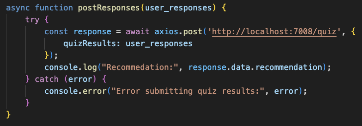

# CS361_microservice_A

This microservice is a plant light requirement quiz!

It provides a GET request path, which gives the client a JSON object of questions and answer choices that the client is to pose to its user. These questions inquire about the type of plant and the light that it currently receives. This microservice also provides a POST route where the client can send the quiz results back to the microservice. The microservice analyzes the results and crafts a light recommendation message that it sends back in the response.

This microservice uses Node and Express to run locally on your device. Please read the following instructions for setup. 

## Set Up
Note: Node must be installed on your device.
Nodemon must all be installed to your device. If you are not sure, run the following command in your terminal:
- _node --version_

\
If the terminal does not responde with the version number, then you will need to install Node. You can do this through the following line, that installs the nodemon package globally on your device.

- _npm install -g nodemon_

\
Next, navigate to the server director within this project folder. You will need to install a few node packages because the .gitignore file has blocked node modules from being added to this repo.\
\
Type the following command in your terminal:
- _npm install express dotenv cors_

## Running Microservice A
Navigate to the server directory. Run the following command in your terminal:
- _npm run dev_

\
The server should be up and running on local host port 7008

## Calling Microservice A
### GET Request for Quiz Question
By submitting a GET request to the /quiz path, the client will receive a JSON object containing each of the questions and their associated answer choices.

That JSON object is formatted like so:

Here is a sample function that submits the GET quiz-questions request, and stores the Q&A portion of the HTTP reponse in a quizQuestions const:

### POST Request for Results
By submitting a POST request to the /quiz path with the quiz responses in request body, the client will receive back a JSON body containing the light recommendations that are calculated based on the quiz responses. 

The request body must be formatted such that the key is quizResults and the value is an array where each element is the string, uppercase letter for each question's response. For example, if the user responded to question 1 with D, question 2 with C, question 3 with B, and question 4 with A, then the request JSON should like so do:
- { quizResults: ['D', 'C', 'B', 'A'] }

Please note that only uppercase letters will be accepted, and that the order in the array must match the order that the questions are given in the quiz. 

The response will be a JSON object with recommendation as the key and value is a string containing the recommendation blurb. Here's how it will look:
- { recommendation: "Here is my recommendation for your plant ... "}

Here is a sample async function that sends a POST request to the /quiz path, with the variable user_responses containing the array of single letter answers in the request body. The microservice reponse is stored in the variable _response_\

### UML Diagram
TO DO: Provide UML diagram

